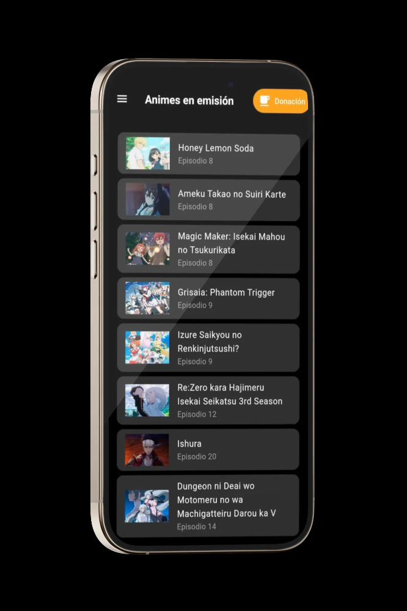
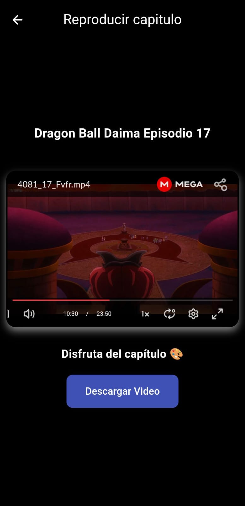
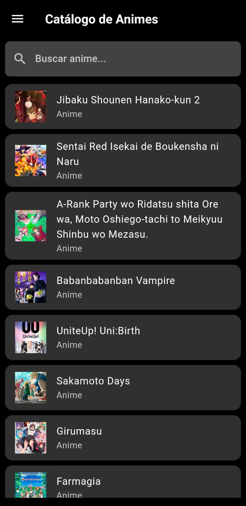

# AnimeGxs
APK de android para ver anime, hecho con flutter, libre de virus

## Vista de las pantallas

> Pantalla de animes en emision, actualizado constantemente.

> Pantalla del reproductor del capitulo con opcion de descargas.

> Pantalla donde se puede ver la lista de catálogos.

## COMO DESCARGAR EL APK 

 >Dirigete a la carpeta src/apk

[APK AnimeGxs](src/)
